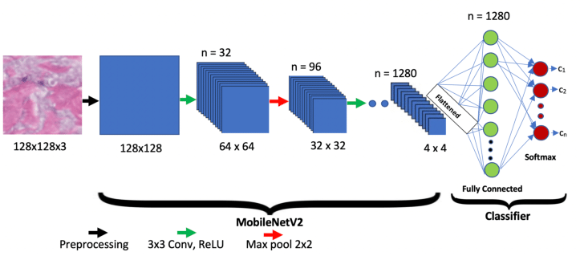

# SolarSense: Solar Panel Dirt Notification
The SolarSense project aims to streamline the detection and notification of dirty solar panels using a combined IoT and machine learning (ML) solution. It leverages a Raspberry Pi camera to capture images, runs a trained ML model locally to detect panel cleanliness, and sends an alert via AWS SNS, AWS Lambda and AWS IoT using MQTT if cleaning is required.


## Table of Contents
1. [API Service](#1-api-service)
2. [IoT Client](#2-iot-client)
3. [Computer Vision Model](#3-computer-vision-model)

## 1. API Service

The API handles the task of sending notifications via AWS Simple Notification Service (SNS) when the IoT system detects dirty solar panels. It is implemented as an AWS Lambda function.

AWS IoT receives a payload containing a device ID and trigger a Lambda function to send an alert via AWS SNS when dirty solar panels are detected.

```typescript
import { APIGatewayProxyEvent, APIGatewayProxyResult } from "aws-lambda";
import { SNS } from "aws-sdk";
import dotenv from "dotenv";

dotenv.config();
const sns = new SNS();

export const handler = async (
  event: APIGatewayProxyEvent
): Promise<APIGatewayProxyResult> => {
  // Function body...
};
```

## 2. IoT Client

The IoT component runs on a Raspberry Pi 3, handling a scheduled image capture, model inference, and publishing messages to AWS MQTT broker when necessary. It runs a local computer vision model to classify solar panel images as either clean or dirty.


### Key Components

1) The `CameraService` class captures images from the Raspberry Pi camera.

- **capture_image()**: Captures an image using the Raspberry Pi camera with OpenCV.
- **dummy_image()**: Loads a static image for testing purposes from the local filesystem.

2) The `ImageProcessor` class handles the preprocessing of captured images to prepare them for model inference.

- **preprocess_image()**: Resizes the image to (224, 224) and normalizes the pixel values to the range \[0, 1].

3) The `ModelService` class is responsible for loading the machine learning model and running inference on the captured image.

- **_load_model()**: Loads the pre-trained TensorFlow model from the provided model path.
- **run_inference()**: Runs inference on a preprocessed image and returns a binary prediction (0 = clean, 1 = dirty).

4) The `predict.py` script orchestrates the process of capturing an image, running inference, and sending a notification via AWS IoT if the panel is dirty. If the ML model predicts the panel is dirty (prediction == 1), the script publishes an MQTT message to the AWS IoT topic.

- **Capture Image**: Uses the `CameraService` to capture an image from the Raspberry Pi camera.
- **Run Inference**: The captured image is processed by the `ModelService` to classify it as clean (0) or dirty (1).
- **MQTT Messaging**: If the panel is classified as dirty (`prediction == 1`), the system publishes an MQTT message to AWS IoT to trigger a notification.

## 3. Computer Vision Model

The machine learning component of SolarSense handles the training, evaluation, and inference for the model which runs on the IoT device to classify solar panel images as clean or dirty.

<div align="center">
 
</div>

### Key Components

1) The configuration file `config-defaults.yaml` defines key parameters for model training, such as the learning rate, batch size, and input image size. These configurations are dynamically loaded during model training using the wandb integration to track experiments.

2) WandB Tracking is integrated to log and monitor the training process.

3) A MobileNetV2 pretrained on ImageNet is used as a backbone model because it is a lightweight model designed for use on edge devices.


