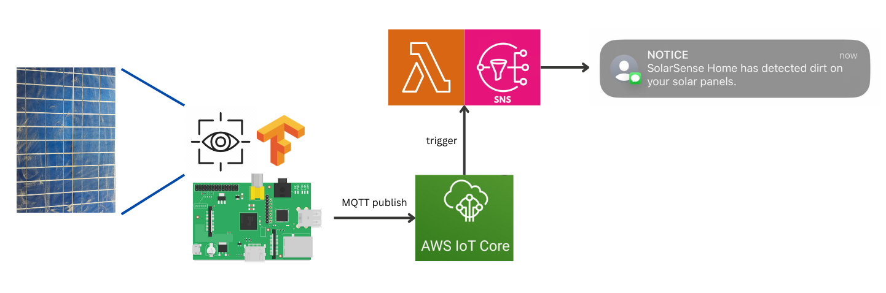
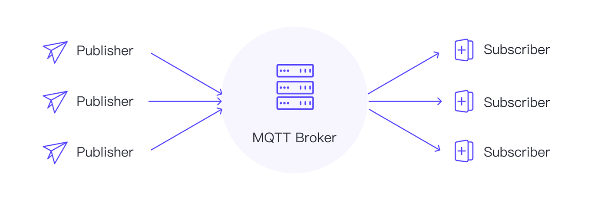

# SolarSense: Solar Panel Dirt Notification

SolarSense is an IoT and machine learning (ML) solution designed to detect and notify users when solar panels require cleaning. By leveraging a Raspberry Pi camera, an onboard TensorFlow Lite model, and AWS cloud services, SolarSense provides an automated system for maintaining optimal solar panel efficiency.



## Table of Contents
1. [Overview](#overview)
2. [System Architecture](#system-architecture)
3. [API Service](#api-service)
4. [IoT Client](#iot-client)
5. [Model Training & Deployment](#model-training--deployment)
6. [Deployment](#deployment)
7. [Future Enhancements](#future-enhancements)
8. [Contributing](#contributing)
9. [License](#license)

## Overview
Solar panels accumulate dirt over time, reducing efficiency. SolarSense automates the detection process by:
- Capturing images using a Raspberry Pi camera
- Running a TensorFlow Lite ML model locally to classify images as clean or dirty
- Automatically deploying updated models via AWS S3 and MQTT
- Sending alerts via AWS SNS when cleaning is required

## System Architecture
The system consists of three key components:
1. **IoT Client:** Runs on a Raspberry Pi, captures images, and performs inference.
2. **API Service:** Handles notifications and integrates with AWS IoT and SNS.
3. **Model Training & Deployment:** Uses AWS S3 and MQTT to update IoT devices automatically.

## API Service
The API is implemented as an AWS Lambda function triggered by AWS IoT. It sends notifications via AWS SNS when a dirty solar panel is detected.

### Workflow:
1. The IoT device publishes an MQTT message to AWS IoT Core.
2. AWS IoT triggers the Lambda function.
3. The Lambda function sends a notification via AWS SNS.

```typescript
import { APIGatewayProxyEvent, APIGatewayProxyResult } from "aws-lambda";
import { SNS } from "aws-sdk";
import dotenv from "dotenv";

dotenv.config();
const sns = new SNS();

export const handler = async (
  event: APIGatewayProxyEvent
): Promise<APIGatewayProxyResult> => {
  // Function implementation...
};
```

## 2. IoT Client



The IoT client runs on a **Raspberry Pi** and is responsible for:
- Capturing images using the Raspberry Pi camera.
- Running inference using **TensorFlow Lite**.
- Publishing results to AWS IoT Core via MQTT.

### Key Components:
- **CameraService**: Captures images using the Raspberry Pi camera.
- **ImageProcessor**: Preprocesses images for inference.
- **ModelService**: Loads and runs the TensorFlow Lite model for classification.
- **MQTTClient**: Handles MQTT connectivity and message publishing.
- **predict.py**: Orchestrates image capture, inference, and MQTT messaging.

### Workflow:
1. Capture image using OpenCV.
2. Preprocess the image (resize, normalize, etc.).
3. Run inference using TensorFlow Lite.
4. If classified as **dirty**, publish an MQTT message to AWS IoT Core.

## 3. Computer Vision Model

The machine learning component of SolarSense handles the training, evaluation, and inference for the model which runs on the IoT device to classify solar panel images as clean or dirty.

<div align="center">
 
</div>

### Key Components

1) The configuration file `config-defaults.yaml` defines key parameters for model training, such as the learning rate, batch size, and input image size. These configurations are dynamically loaded during model training using the wandb integration to track experiments.

2) WandB Tracking is integrated to log and monitor the training process.

3) A MobileNetV2 pretrained on ImageNet is used as a backbone model because it is a lightweight model designed for use on edge devices.


